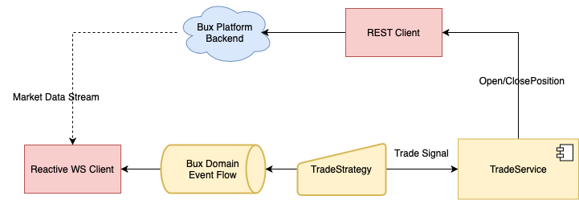

#### Status
[](https://travis-ci.com/alicanalbayrak/basic-trading-bot)
[](https://codecov.io/gh/alicanalbayrak/basic-trading-bot)


## Basic Trading Bot


Very basic trading bot that tracks the price of a certain product and will execute a pre-defined trade in the said
product when it reaches a given price. After the product has been bought the trading bot should keep on tracking the
prices and execute a sell order when a certain price is hit.

#### Components overview

- bux-api-platform-api-client: Implements BUX platform client abstractions and webSocket connection protocol.
- bux-platform-trading-app: Trading orchestration.



### Build

#### Pre-requisites

- [Java 16](https://jdk.java.net/16/)
- [Maven](https://maven.apache.org/download.cgi) (preferably [3.6.0)+)

#### Build instructions

In the project's root directory run:

```
$ mvn clean package
```

* bux-platform-trading-app is configured to create shaded jar in its target folder.

#### Running the application

##### Application Arguments

Following arguments should provided as JSON string to the application. The rationale behind forcing user to pass the
JSON is, apart from easier validation, to provide seamless integration with serverless environments such AWS Lambda,
Azure Functions. etc.

* The product id
* The buy price. If the stock price doesn't reach that price the position shouldn't be opened.
* The upper limit sell price. This is the price you are willing to close a position and make a profit.
* The lower limit sell price. This the price you want are willing to close a position at and make a loss.

```
$ java --enable-preview -jar bux-platform-trading-app-1.0-SNAPSHOT.jar "{ \"productId\":\"sb26502\", \"buyPrice\": \"1.18231\", \"upperSellLimit\": \"1.18242\", \"lowerSellLimit\": \"1.18230\" }"
```

* **Since this project heavily uses Records `--enable-preview` argument is super important.**  
